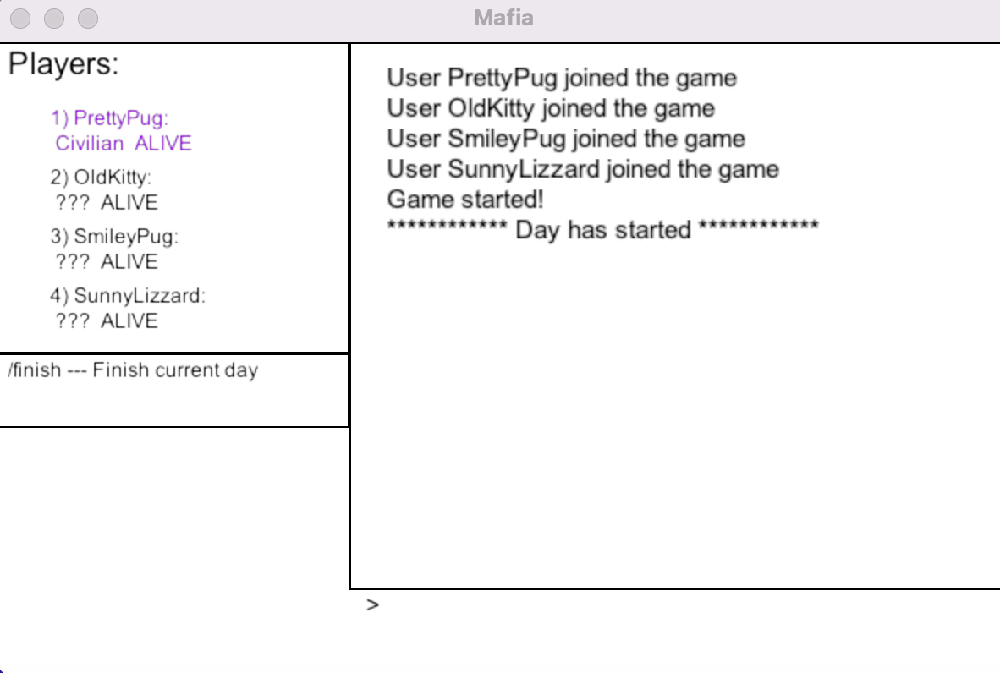

# Практика 2

Реализовано клиент-серверное приложение "Мафия" на основе gRPC. 

Сервер работает в докере, клиенты с ui -- нет. 

Все требования по функционалу были реализованы. Работа сделана на 10 баллов. 

## Как использовать

### Запуск

1. Открыть 5 разных терминалов.
2. В первом запустить скрипт, который устанавливает необходимые пакеты, собирает докер-образ и запускает контейнер с сервером командой

    ```python
    ./init.sh
    ```
3. Немного подождать, пока поднимется RabbitMQ

4. В остальных терминалах запустить клиентов: 
    ```python
    python3 mafia.py
    ```
    В аргументах также можно ввести адрес сервера. По умолчанию будет использоваться `:50051`

Первый клиент работает в ручном режиме, остальные три - в автоматическом. 

### UI
Графический пользовательский интерфейс был написан с помощью библиотеки `arcade`, игрового движка на python. 



В секции *Players* отображены участники текущей сессии игры. Фиолетовым выделен сам пользователь. Также здесь отображаются роли и статус игроков. 

Ниже - секция с доступными на данный момент командами. Они разные в зависимости от состояния игры и роли игрока. 

Правее расположена секция, где отображаются события игры и действия игроков. 

Под ней - поле для текстового ввода, куда пользователь может печатать команды (обязательно в конце надо нажать Enter): 

- `/register {name}` - зарегистрироваться под именем name
- `/finish` - завершает текущий игрвой день
- `/vote {player_number}` - проголосовать за игрока с номером player_number, которое может быть от 1 до 4 и представлять живого игрока. 
- `/publish` - (для шерифа) опубликовать кто мафия 
- `/kill {player_number}` - (для мафии) убить игрока с номером player_number
- `/check {player_number}` - (для шерифа) проверить игрока с номером player_number


### Игра
В игровой сессии участвует 4 игрока: Мафия, 2 мирных жителя и шериф. 

- Игра начинается в игровой день
- В игровой день (кроме первого) игроки голосуют за других игроков командой `/vote`. Если шериф знает кто мафия и еще не поделился этой информацией со всеми, он может это сделать командой `/publish`. После завершения голосования игроки должны завершить игровой день командой `/finish`
- После того, как все проголосовали и завершили день, сервер публикует данные по отмененным (cancelled) игрокам. 
- Наступает ночь. Мафия должна выбрать жертву командой `/kill`. Шериф должен выбрать кого проверить командой `/check`
- Ночь завершается, наступает день.  

## Структура

Сервер многопоточный, клиент однопоточный. 

Сервер является также gRPC-сервером, соответствующие команды и сообщения приведены в файле `server.proto`. Его состояние описывается игровыми сессиями, которые прошли или идут в настоящий момент. Игровая сессия (Room) поддерживает информацию о текущих игрока, добавляет новых, проверяет, не отключился ли игрок, и реализует всю логику игры. 

Клиент раз в секунду отправляет серверу запрос `GetUpdates`, который возвращает все события, произошедшие в системе и релевантные для этого игрока, с момента последнего вызова этого запроса. На основе полученных событий, клиент меняет свое состояние и ui. 

Когда клиент отправляет команду в ui с помощью текстового поля, он также отправляет соответствующий gRPC-запрос серверу. 

# Практика 3
Чат реализован с помощью RabbitMQ

Чтобы отправить сообщение, нужно ввести его в поле текстового ввода и нажать Enter.

Общаться могут все пользователи независимо от режима (ручной/автоматический). Днем общаются все, ночью - только мафии друг с другом и только шерифы друг с другом.

Для каждой сессии сделан отдельный чат. 

Все требования по функционалу были реализованы. Работа сделана на 10 баллов 